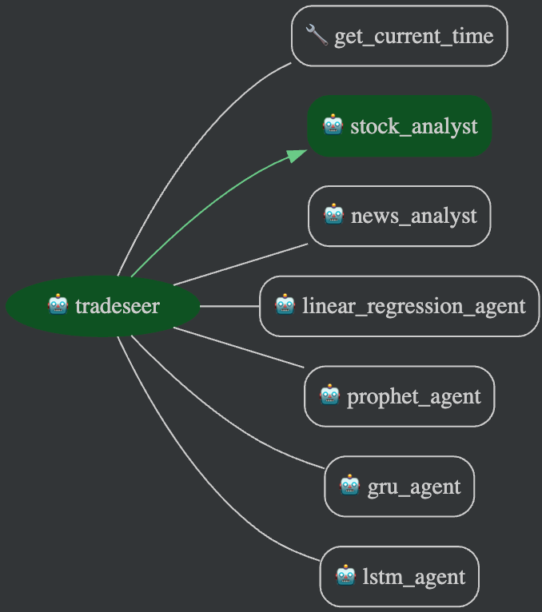

# tradeseer-ai



<br clear="left"/>
<br/>
<br/>

As an investor and technologist, I constantly found myself switching between multiple platforms—Yahoo Finance for prices, Google News for headlines, and Python scripts for forecasts. I wanted a unified, conversational experience where I could simply ask, "What’s the forecast for AAPL using LSTM?" and get a smart, context-aware response. That’s where the idea for TradeSeer-AI was born: an intelligent multi-agent system that feels like a team of financial analysts available 24/7.

**TradeSeer‑AI** is a multi‑tool AI-powered agent designed for financial insights:
- 🔍 Real-time stock price lookup
- 📰 Market news summaries
- 📈 Price forecasting via diverse models: Linear Regression, LSTM, GRU, Prophet

## 🚀 Features

- **Stock Analyst** — fetches current stock prices using Yahoo Finance
- **News Analyst** — retrieves and summarizes recent news
- **Time Tool** — provides the current date & time
- **Forecast Tools** — predict future prices using:
  - Linear Regression (trend-based)
  - LSTM (sequence-based neural net)
  - GRU (lightweight neural net with sequence memory)
  - Prophet (seasonal trend forecasting)

## 🔧 Setup

```bash
# Clone the repo
git clone git@github.com:zhangxijing97/tradeseer-ai.git
cd stock-info-agent

# Create a virtual environment (optional but recommended)
python -m venv .venv
source .venv/bin/activate  # On Windows: .venv\Scripts\activate

# Install dependencies
pip install -r requirements.txt
```

## 🔐 Google API Key

Before running the agent, you need to create a `.env` file in the project root directory and set your `GOOGLE_API_KEY`.

You can obtain your key from [Google AI Studio](https://makersuite.google.com/app).

### 📝 Create the `.env` file

Run the following commands in your terminal:

```bash
echo "GOOGLE_GENAI_USE_VERTEXAI=0" > .env
echo "GOOGLE_API_KEY=your_google_api_key_here" >> .env
```

## 🏁 How to Run

After setup and adding your API key, you can run the agent in two primary ways:

### Option 1: Interactive Web Console (Recommended for Testing)

This command starts the ADK developer UI, providing an interactive web-based chat console to test your agent immediately.

1.  Run the following command in your terminal:
    ```bash
    adk web
    ```
2.  This will automatically open the interface in your default browser (usually at `http://localhost:8080`).
3.  Once loaded, you can start typing prompts.

### Option 2: Headless API Server (For Production/Integration)

This command runs the agent manager as a "headless" backend service. This is ideal for production or for integrating with a custom frontend application.

1.  Run the following command:
    ```bash
    adk serve
    ```
2.  This starts the server (by default at `http://localhost:8080`) without launching a browser.
3.  You can now send API requests to this endpoint (e.g., using `curl`, Postman, or your custom app) to interact with the agent.

## ⚙️ Usage

Run the ADK manager server or developer UI. In the console, type natural prompts:

- **Stock price**  
  ```
  What is the current price of AAPL?
  ```
- **News query**  
  ```
  What's the latest news on Tesla?
  ```
- **Forecast with specified model**  
  ```
  Predict AAPL price using LSTM for 5 days ahead.
  ```
- **Forecast without model**  
  ```
  Forecast NVDA stock price.
  ```  
  _Agent will ask you: “Which prediction method would you like to use?”_

## 🧪 Testing Inputs

Use the following inputs to verify capabilities:

| Use Case                   | Sample Input |
|----------------------------|--------------|
| Stock price lookup         | `Check the current price of TSLA.` |
| Market news                | `Give me news updates on Google.` |
| Time query                 | `What time is it now?` |
| Linear Regression          | `Forecast MSFT using linear regression for 3 days.` |
| LSTM prediction            | `Predict NVDA with LSTM for 7 days.` |
| GRU prediction             | `Forecast AAPL via GRU.` |
| Prophet prediction         | `Use Prophet to forecast GOOGL 5 days out.` |
| Method clarification       | `Predict the price of AMZN.` <br> _Expect agent to ask for model choice._ |
| Multi-tool query           | `Tell me AAPL price & forecast it using GRU.` |

## 🛠️ Contribution

Contributions welcome! To add new prediction models:

1. Create a new tool under `/sub_agents`
2. Register with `AgentTool(...)`
3. Update `root_agent` import list and instructions
4. Add appropriate test cases